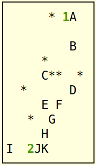
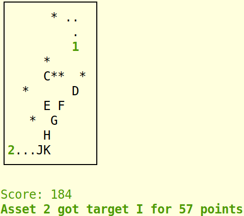

# SI335 Project: The Battlefield

## Overview

> *Now the general who wins a battle makes many calculations in his
> temple ere the battle is fought. The general who loses a battle makes
> but few calculations beforehand. Thus do many calculations lead to
> victory, and few calculations to defeat; how much more no calculation
> at all! It is by attention to this point that I can foresee who is
> likely to win or lose.*
>
> ---Sun Tzu, *The Art of War*

In this project, you are going to find optimal or nearly-optimal paths
for some number of *assets* to acquire a number of *targets* in a
battlefield, while avoiding some *obstacles*.

The basic idea is this: The assets each move around the battlefield at
the same time. They are trying to go to each target in order to get
points. Your task is to make a plan for how the assets will move around.

**Moving**: Only the assets move; the targets and obstacles stay in
place. At each step, every asset moves one space either up, down, left,
or right. If an asset moves into a space with a target, you get the
points for that target (see below). If an asset moves into a space with
an obstacle, that asset is gone and any further moves of the asset are
ignored. Same if the asset moves outside of the boundaries. (Nothing
special happens if two assets occupy the same space.)

**Scoring**: Each target starts with a value, which will be some
positive integer. **At each step, the value of every remaining target
goes down by one**. The battle ends when all targets have been acquired,
or all their values have gone down to zero, or all assets have run into
obstacles, or your plan has run out of moves.

Your task is to read in a description of the map (dimensions, obstacles,
assets, and targets) and output a series of moves for all the assets to
take in parallel, in order to acquire the targets as quickly as
possible. The goal is to get the highest score, which is the total value
of all targets at the time you acquire them.

## Reminders

-   Review the
    [relevant section from the course policy](https://usna.edu/Users/cs/roche/335/resources/policy.php#collaboration)
    on honor and allowed collaboration for programming projects.
-   **If you have any doubt about what is allowed, just ask!**
-   Part of your grade will be based on \"coding style\". This is mostly
    about whether your code is easy to follow, consistently formatted,
    and sensibly designed. You should use meaningful
    variable/function/class names, clearly explain what is going on in
    your code, and \"clean up\" any extra debugging or non-functional
    parts before submitting.
-   Be sure to follow the **exact input/output specifications and
    filename conventions** as specified. **You should write any error or
    debugging messages to stderr (cerr)**, as this stream will be
    ignored in testing.
-   Your program will automatically compiled and tested by a variety of
    exciting bash scripts. This means that it is imperative that your
    code **compiles without errors** in the CS linux lab environment and
    that it behaves exactly as specified. There will be a few "sanity"
    checks in the submit system that you should take advantage of.

Input and output
================

The input to your program will be a single file that stores a \"map\"
specifying the battlefield dimensions, the number and locations of any
obstacles, the number and locations of any assets, and the number,
location, and *value* of any targets.

Specifically, the input map file consists of four parts:

1.  **Dimensions**: Two integers for the number of rows and columns in
    the battlefield,
2.  **Obstacles**: An integer for the number of obstacles, followed by
    that many pairs of integers for the coordinates of each obstacle.
3.  **Assets**: An integer for the number of assets, followed by that
    many pairs of integers for the starting coordinates of each asset.
4.  **Targets**: An integer for the number of targets, followed by that
    many triples of integers, indicating the row index, column index,
    and *value* of each target.

The output from your program will be in a file specifying the \"moves\"
that each asset should make in order to reach the targets quickly.
Specifically, your output will consist of a number of lines, one per
step. On each line, there will be *k* directions, where *k* is the
number of assets. Each direction is either `U`, `D`, `L`, or `R`. Note
it is not allowed for an asset to stand still!

Example
=======

Here is an example map file:

    10 12

    7
    0 6
    3 5
    4 6
    4 7
    4 10
    5 2
    7 3

    2
    0 8
    9 3

    11
    0 9 36
    2 9 95
    4 5 56
    5 9 56
    6 5 88
    6 7 81
    7 6 12
    8 5 76
    9 0 60
    9 4 96
    9 5 74

You can see that the file above is split into 4 parts:

1.  **Dimensions**: The map has 10 rows and 12 columns.
2.  **Obstacles**: The map has 7 obstacles, at the specified
    coordinates.
3.  **Assets**: There are 2 assets, at the specified coordinates.
4.  **Targets**: There are 11 targets, at the specified coordinates.
    Each target also has a specified *starting value*.

A visual representation of this map (which you could see yourself by
running `python3 show.py <map_file>`) is below. The obstacles are black
diamonds, the assets are the numbered blue squares, and the targets are
the letters in magenta.

**Notice: rows and columns are numbered from 0, starting at the top-left
corner.**

The output from your program will be a list of *moves* for the assets.
For the map above, it might look something like this:

    RL
    DL
    DL
    DR
    DR
    DR
    DR
    LR
    LU
    UU
    UR
    UL
    UU
    UU
    RU

You can see there are a number of lines, and on each line there is one
direction for each of the assets to move in. So the first line above
says asset 1 should move one space to the right, and asset 2 should move
1 space to the left. On step 2, asset 1 changes direction to move down,
and asset 2 keeps moving left. They both keep going in the same
direction on step 3.

Here\'s what those three steps look like on the map. (You could see this
by running `python3 show.py <map_file> <moves_file>`.)

Limitations and assumptions
===========================

You may assume the map files always fall within the following limits:

1.  Each **dimension** is at least 1 and at most 200.
2.  The number of **assets** is at least 1 and at most 3
3.  The number of **targets** is at most 26.

You can implement your solution in C++, Python, or Java (or something
else if you talk to Dr. Roche about it). In any case, it must complete
execution and output all the moves **within 30 seconds runtime**. Of
course, it\'s OK if it\'s faster than that!

Initially, you may assume that all obstacles, targets, and assets are in
distinct locations. Assets are not allowed to move onto obstacles, but
they can move into the same square as each other if you want to do that
for some reason. Keep in mind, you only get points for a target the
*first time* any asset reaches that target.

README file
===========

Your submission **must** include a `README.txt` file with at least the
following information:

-   Any outside resources you used
-   A high-level description of how your program works. I don\'t need
    pseudocode here, but it should explain your algorithm, what kinds of
    algorithms or ideas from class it uses, and what kinds of data
    structures you are using.
-   What *algorithm design paradigms* did you employ in designing your
    algorithm?
-   Give some discussion of what the big-Oh *runtime* of your program
    is. It\'s OK if you don\'t have something totally exact here, but be
    as specific as you can.

Starter code
============

There is no starter code for the `plan` program that you are going to
write. You really get to write it yourself, from scratch!

The following three Python programs should be helpful in testing and
developing your code. The `generate.py` program will generate a random
map with the specified dimensions and number of obstacles, assets, and
targets. The `show.py` program will make a nice visual \"movie\" of your
moves, along with the scores, so you can see what your program is
producing. The `score.py` program does the same, but there\'s no visual
component, just the scores. This is mostly useful for when you get into
the bigger maps that might be too large to fit on the screen visually.

You run each of these programs by typing, for example,
`python3 generate.py`. They all have nice help messages if you run them
with the `-h` flag.

Submission instructions
=======================

Submit according to the normal instructions [on this
page](../submit.php). You have a choice of programming in Java, C++, or
Python. In any case, your program will take **two command-line
arguments**. The first will specify the map filename (your input), and
the second will specify the moves filename (your output).

Java specifics
--------------

Put your `main()` method in a class called `Plan` in a file called
`Plan.java`. You can also submit any other `.java` files you like, and
you also need to submit your `README.txt`. I will compile and run your
program like:

    $ javac *.java
    $ java Plan mapfile movesfile

C++ specifics
-------------

Put your `main()` method in a file called `plan.cpp`. You can also
submit any other `.cpp` or `.h` files you like, and you also need to
submit your `README.txt`. I will compile and run your program like:

    $ g++ -O3 -std=c++11 *.cpp -o plan
    $ ./plan mapfile movesfile

Python specifics
----------------

Put your main program in a file called `plan.py`. You can also submit
any other `.py` files you like, and you also need to submit your
`README.txt`. I will run your program like:

    $ python3 plan.py mapfile movesfile

Grading
=======

Your program will be tested on a variety of maps ranging from the
smallest possible, with one asset and few obstacles and targets, to the
largest possible 200x200 with three assets, many obstacles, and 26
targets.

Remember, your program has to **finish within 30 seconds** on any input
file. Otherwise, you won\'t get any points for that map.

After running your plan program, I will use the `score.py` program,
along with the map file, to find out how many points your \"moves\"
score. Say your moves score \\(x\\) points. After looking at all of the
sumbissions, as well as my sample solutions, I will also get the maximum
number of points any of them score on that map file, which I will call
\\(m\\). Your grade for that map will be determined from the ratio
\\(\\frac{x}{m}\\) of your points divided by the maximum number of
points for that map. There will be bonus points available *on every
sample map*, if you get the maximum number of points (or close to it).

As usual, besides these auto-tests, your program will also be graded on
readability, documentation, and code organization. Follow the \"coding
guidelines\" outlined at the beginning of this page.
